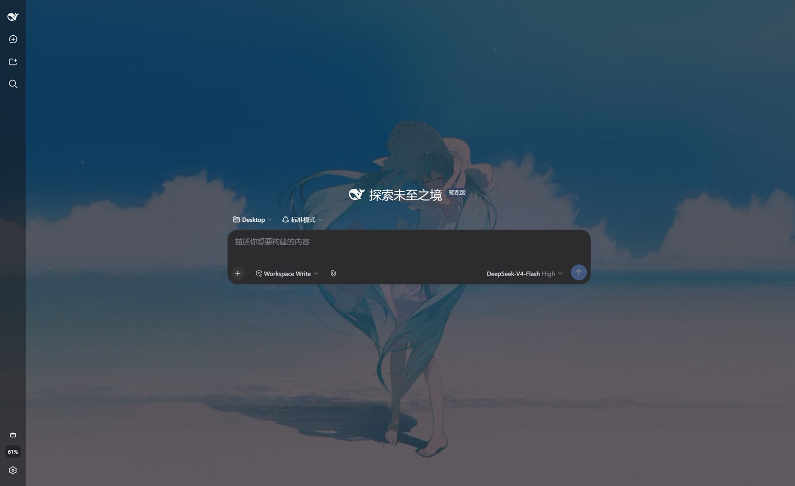

# dsh-wallpaper-engine

把本机 Wallpaper Engine 里**已经下载的壁纸**接入 DeepSeek Harness，作为 Web 界面
的背景（动态壁纸视频也支持）。Use wallpapers downloaded by Wallpaper Engine as
the DeepSeek Harness web background.

## 效果预览



## 功能

- 自动发现 Wallpaper Engine 已下载内容：
  - Steam 创意工坊壁纸（app 431960，自动读取 `libraryfolders.vdf`，支持多 Steam 库）；
  - 本地项目（`projects/myprojects`、`projects/defaultprojects`）。
- 在 **设置 → 壁纸 Wallpaper Engine** 中浏览缩略图、搜索、一键使用；
- **自动同步**：打开壁纸页时每 30 秒静默重扫磁盘，Wallpaper Engine 里新下载的壁纸会自动出现（也可点「刷新」立即更新）；
- 视频壁纸以 `<video>` 方式播放（`muted + loop`）；图片壁纸优先使用目录内**最高分辨率原图**（而非小尺寸预览图），并支持「铺满 / 完整显示」两种适配模式（完整显示带毛玻璃背景填充）；
- 「面板暗化（0–100%）」与「背景压暗（0–50%）」两个滑杆控制可读性；
- 选择会持久化到 `$DSH_HOME/dsh-wallpaper.json`，重启 / 刷新后自动恢复。

## 安装

在 `dsh` 安装目录（或任意目录）执行：

```sh
dsh plugin --profile web add file:C:\path\to\dsh-wallpaper-engine
```

或手动方式（与 `dsh plugin add` 等价）：

1. 在 `$DSH_HOME/profiles/web` 下 `pnpm add file:<本插件绝对路径>`；
2. 在该 profile 的 `cordis.patch.yml` 中加入：

   ```yaml
   - insert:
       - id: dsh-wallpaper-engine
         name: dsh-wallpaper-engine
   ```

3. 刷新浏览器页面（若服务端未热加载，重启 `dsh web`）。

## 使用

1. 打开 DeepSeek Harness Web 界面；
2. 进入 **设置 → 壁纸 Wallpaper Engine**；
3. 点击任意壁纸卡片即可设为背景，再次点击「清除背景」恢复默认。

## 配置

插件支持可选配置（在 profile 的 `cordis.patch.yml` 中以 id 覆盖）：

```yaml
- id: dsh-wallpaper-engine
  config:
    workshopDir: "D:\\steam\\steamapps\\workshop\\content\\431960"
    projectsDir: "D:\\steam\\steamapps\\common\\wallpaper_engine\\projects\\myprojects"
```

也支持环境变量（`;` 分隔多路径）：

- `DSH_WALLPAPER_WORKSHOP_DIR` — 创意工坊壁纸目录；
- `DSH_WALLPAPER_STEAM_DIR` — Steam 根目录（用于推导 workshop 与本地项目）。

## HTTP 路由

| 路由 | 说明 |
|---|---|
| `GET /dsh-wallpaper/list` | 壁纸列表 + 检测到的来源目录 |
| `GET /dsh-wallpaper/config` | 当前持久化的选择 |
| `POST /dsh-wallpaper/config` | 持久化选择 `{id, dim, overlay}` |
| `GET /dsh-wallpaper/preview/<id>` | 缩略图 |
| `GET /dsh-wallpaper/file/<id>` | 壁纸媒体文件（支持 Range，用于视频） |

所有 id 均通过扫描生成的映射查找，不参与路径拼接，避免路径穿越。

## 限制

- 场景型（scene）与网页型（web）壁纸无法在浏览器背景中实时渲染，回退为预览图；
- 视频通过本机 HTTP 流式传输，仅本机访问（默认 loopback）。
